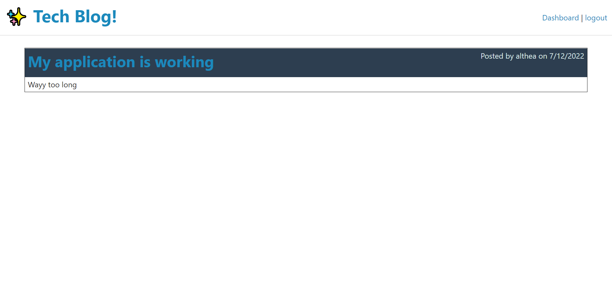

# Tech Blog

## Table of Contents
- [Description](#description)
- [Installation](#installation)
- [Usage](#usage)
- [Application](#application)
- [images](#images)
- [Tests](#tests)
- [questions](#questions)
- [Contributing](#contributing)
- [License](#license)
- [Copyright](#copyright)

## Description
- ExpressJS SQL Tech blog where users may sign in to add posts and comments

## Installation

Follow these steps to install this project on your local machine.
- Open Bash editor
- mkdir TechBlog
- cd TechBlog
- git clone https://github.com/Altheahanson/TechBlog.git
- npm install

## Usage
- After cloning this repository...
- Open bash terminal 
- Developer mode ='npm run dev'
- Developer mode ='npm run start'

## Application
- Link to Deployed Application on Heroku: https://pacific-atoll-54698.herokuapp.com/

## Images
- 

## Tests
- Email me

## Questions
- Username: GitHub
- GitHub: https://github.com/Altheahanson
- Email: altheacarlenehanson@gmail.com

## Contributing
- Email me

## License
- This project is licenses under the General Public License v3.0 license.

## Copyright
- © Copyright 2022 Althea Hanson